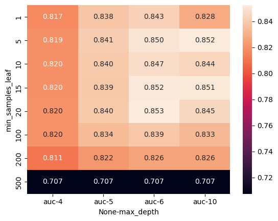
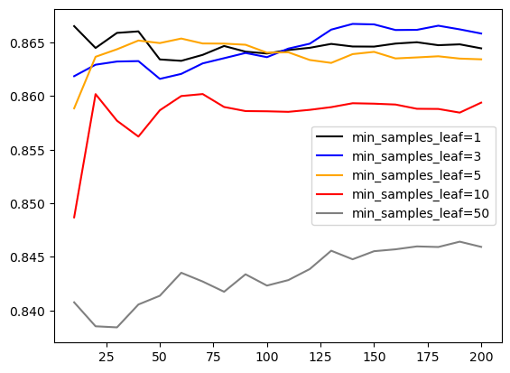
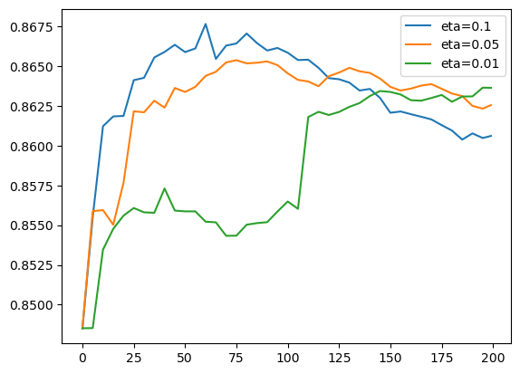
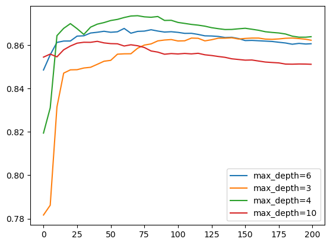

# Employee Turnover Prediction


## Dataset Overview

**About the Data**
The dataset comprises various features, both categorical and numerical, aiming to predict whether employees will leave the company in the future. These attributes provide valuable insights for HR decision-making and employee retention strategies.

**Dataset Details:**
- **Education:** Education level of the employee.
- **JoiningYear:** Year in which the employee joined the company.
- **City:** City where the employee's office is located.
- **PaymentTier:** Payment tier categorization (1: Highest, 2: Mid Level, 3: Lowest).
- **Age:** Current age of the employee.
- **Gender:** Gender of the employee.
- **EverBenched:** Whether the employee has ever been kept out of projects for 1 month or more.
- **ExperienceInCurrentDomain:** The number of years of experience employees have in their current field.
- **Label:**
  - **LeaveOrNot:** Binary indicator of whether the employee is predicted to leave the company in the future (1: Leaves, 0: Stays).

**Dataset Source:**
The dataset can be found on [Kaggle](https://www.kaggle.com/datasets/tawfikelmetwally/employee-dataset/data).

## Problem Description

The primary objective is to develop a predictive model that accurately forecasts employee turnover in the future. The model's insights will empower HR teams to proactively address retention challenges and implement strategic initiatives to enhance employee satisfaction, ultimately reducing attrition.

## 1. Exploratory Data Analysis (EDA)

- **Analysis of Categorical Variables:**

    - **Education Distribution:**
        - Visual representation of the distribution of education levels.
        - 

    - **City Distribution:**
        - Exploration of the distribution of the cities where employees' offices are located.
        - 

    - **Gender Distribution:**
        - Examination of the distribution of genders among employees.
        - 

    - **Ever Benched Distribution:**
        - Analysis of the distribution of employees who have been benched.
        - 

    - **Joining Year Distribution:**
        - Visualizing the distribution of the years when employees joined the company.
        - 

    - **PaymentTier Distribution:**
        - Distribution of payment tier categorization.
        - 
              
- **Analysis of Numerical Variables:**

    - **Age Distribution:**
        - Investigating the distribution of ages among employees.
        - 

    - **Experience in Current Domain Distribution:**
        - Examining the distribution of years of experience in the current domain.
        - 

### Target Variable Analysis:

#### Target Summary with Numeric:

- **Age:**
    - Leave: 29.052500
    - Stay: 29.571896

- **Experience in Current Domain:**
    - Leave: 2.840000
    - Stay: 2.940059

#### Target Summary with Categorical:

- **Education:**
    - Bachelors: 0.313524
    - Masters: 0.487973
    - PHD: 0.251397

- **City:**
    - Bangalore: 0.267056
    - New Delhi: 0.316335
    - Pune: 0.503943

- **Gender:**
    - Female: 0.471467
    - Male: 0.257739

- **Ever Benched:**
    - No: 0.331257
    - Yes: 0.453975

- **LeaveOrNot:**
    - 0: 0.0
    - 1: 1.0

- **Joining Year:**
    - 2012: 0.216270
    - 2013: 0.334828
    - 2014: 0.247496
    - 2015: 0.407170
    - 2016: 0.222857
    - 2017: 0.268051
    - 2018: 0.986376

- **PaymentTier:**
    - 1: 0.366255
    - 2: 0.599129
    - 3: 0.275200

## 2. Prepare Data for Model Training

- Extract only those rows in the column `LeaveOrNot` where the value is either `Stay` or `Leave`.
- Split the data into train, validation, and test sets in a two-step process, resulting in a distribution of 60% train, 20% validation, and 20% test sets. Use a random seed of `11`.
- Prepare the target variable `LeaveOrNot` by converting it from categorical to binary, where 0 represents `Stay` and 1 represents `Leave`.
- Delete the target variable from the train, validation, and test dataframes.

## 3. Training Models

We aim to identify the most suitable model by training various models and evaluating their performance using the roc_auc_score. The model with the highest roc_auc_score will be considered the most effective.

### Decision Tree

- Use `DecisionTreeClassifier()`.
- Compare `y_pred` (with `X_train`) and `y_train`, it shows `roc_auc_score = 0.9855092934065315`.
- Compare `y_pred` (with `X_val`) and `y_train`, it shows `roc_auc_score = 0.7861772633103365`. The training model seems to be overfitting.

**Tuning:**
- `max_depth` (how many trees): pick a relatively high roc_auc_score value; the result can be varied.
- `min_samples_leaf` (how big the tree is): set a range of max_depth from the last step, in each depth, loop through a group of `min_samples_leaf`.
  - Make a dataframe of `"max_depth", "min_samples_leaf", "roc_auc_score"` and use seaborn to generate a heatmap; select one of the best combinations, e.g., `max_depth=6`, `min_samples_leaf=5`.
  
  - Calculate the roc_auc_score.

### Random Forest
- `from sklearn.ensemble import RandomForestClassifier`
- pick a range from 10 to 200 to train the model
- turn it to dataframe and plot it (`n_estimators = 180` seems to be the best), but we dont fix it yet
  

**Tuning:**
- `max_depth`: range [5, 10, 15]
    - For each depth, loop through all `n_estimators`.
    - Set the seed to fix the result with `random_state=1` to help the model process faster [optional]`n_jobs=-1`.
    - Plot the result to find the best `max_depth`: 10.
    
- `min_samples_leaf` (how big the tree is): range [1, 3, 5, 10, 50]
    - For each `min_samples_leaf`, loop through all `n_estimators`.
    - Set `max_depth` to 10, set the seed to fix the result with `random_state=1` to help the model process faster [optional]`n_jobs=-1`.
    - Plot the result to find the best `min_samples_leaf`: 3.
    
- Use `n_estimators=180, max_depth=10, min_samples_leaf=3` to train the model.
- The roc_auc_score result has improved compared to the decision tree model.

### XGBoost
- `import xgboost as xgb`
- train the model
    ```features = list(dv.get_feature_names_out())
    dtrain = xgb.DMatrix(X_train, label=y_train, feature_names=features)
    dval = xgb.DMatrix(X_val, label=y_val, feature_names=features)```
- xgb_output(output) function to capture the output (number interation, train_rmse, val_rmse)
- plot the graph
  

**Tuning**                                                                                                                                                                      
    XGBoost has various tunable parameters but the three most important ones are:

- `eta` (default=0.3)
  - It is also called `learning_rate` and is used to prevent overfitting by regularizing the weights of new features in each boosting step. range: [0, 1]
- `max_depth` (default=6)
  - Maximum depth of a tree. Increasing this value will make the model mroe complex and more likely to overfit. range: [0, inf]
- `min_child_weight` (default=1)
  - Minimum number of samples in leaf node. range: [0, inf]
    - Tuning the learning rate helps you tell the model what speed it would use in deriving the minimum for the weights.
    `eta=0.1` is the best (faster and more accurate)
  
    - `max_depth`: how many trees? `max_depth=4` is the best.
  
    - `min_child_weight`: how big is the tree? `min_child_weight=10` is the best.
      

## 4. Choose the Final Model and Model Testing

- XGBoost was selected as the final model, which yielded the best results.
- Tested the XGBoost model on the full training dataset.
